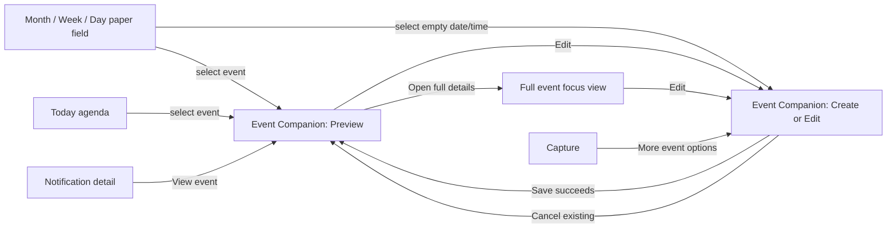
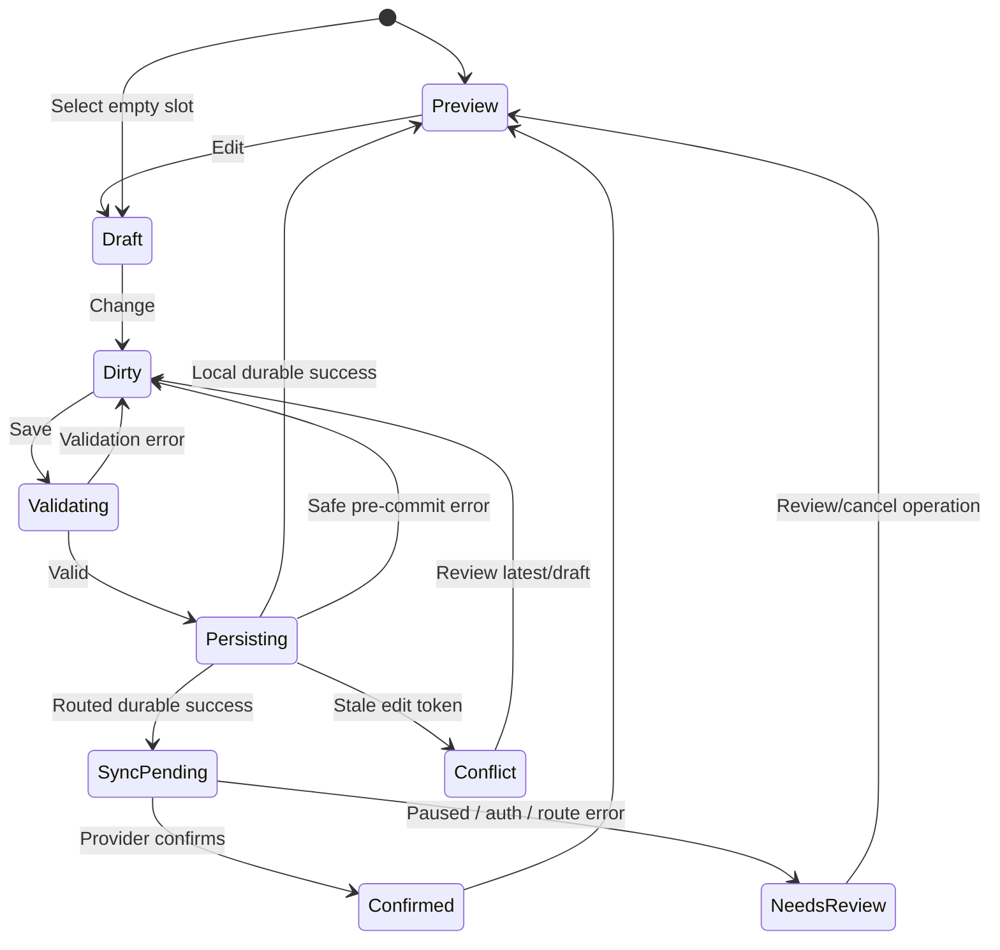

# Definitive Jin calendar experience

## Scope

Intent class: `STRATEGIC CHANGE`.

Turn Jin's existing Month/Week/Day calendar into one coherent planning workspace while preserving the implemented Google stable-release baseline, Jin's paper/ink/indigo visual language, exact provider truth, accessibility, and Today contract.

### In scope

- One adaptive Event Companion and one preview → edit/create interaction grammar.
- In-context event selection, empty-slot creation, pointer range selection, editable-event move/resize, and equivalent keyboard/single-pointer form paths.
- Unified `EventDraft`, composer sections, validation, serializer, capability presentation, recurrence scope, temporal preview, and operation status.
- Calendar identity and local display filtering across Month/Week/Day/preview/detail.
- Full recurrence creation/edit UX for the rules already supported by core.
- Explicit timezone/DST, all-day, cross-midnight, pending, conflict, reauth, and recovery semantics.
- Shared adoption by Calendar, Today, Capture, Notifications, and full event detail without erasing each surface's intended density.
- CSS ownership cleanup, responsive/accessibility behavior, deterministic tests, native Tauri owner review, real-provider gates, and task-based usability validation.

### Retained baseline

- Exact Google account/calendar routing and calendar-derived color.
- Durable local canonical save plus outbox/sync/review behavior.
- Current create/edit/delete/cancel, guest update policy, Meet, RSVP, stale-token conflict, recurrence scope, and auth recovery contracts.
- `TodayProjectionDto`, Today schedule/task separation, Notification Center invitation ledger, and shared invitation response controls.
- Current core DST resolution: ambiguous uses the earlier instant; an ordinary one-hour nonexistent interval shifts forward one hour with a resolution note, while a still-unresolved non-standard gap errors.

### Out of scope

- Native proposed-time, Gmail transport, attendee time-suggestion comments, or any time-suggestion UI.
- `this_and_following` recurrence edits.
- Moving an already-published event to another account/calendar.
- Physical room directory/search, availability products, scheduling links, calendar sets, bulk edit, provider opening links, travel time, reminders redesign, attachments, AI features, photos, named days, countdowns, or circles.
- A third-party calendar UI library, replacement calendar geometry engine, new provider, or generalized command palette.
- Any claim that Google delivered an invitation email.

### Assumptions

1. Existing capability DTOs remain the authority for edit/delete/recurrence/collaboration actions. Risk if wrong: the UI could expose unsupported direct manipulation.
2. Existing routed/local mutation commands remain the write authority. Risk if wrong: a second mutation pipeline would duplicate recovery and exact-route guarantees.
3. A 920px normal-scale Calendar-workspace content box leaves a useful 559px grid beside a 360px companion and 1px rule. Risk if wrong: visual QA may amend the seam, but must preserve one non-oscillating container-width owner.
4. Current core DST policy is intentional and stable. Risk if wrong: changing it requires a separate data/time decision, not a GUI patch.

Right-size score: `6` → `full`. Complexity: `11/12` → `human_loop`. The user's request authorizes research and planning only; no confidence verdict authorizes implementation without a new greenlight.

## Approach

Adapt Jin's existing time-grid geometry, capability DTOs, durable mutation commands, invitation ledger, `JinModal`, and Today preview pattern into one Event Companion architecture. Build temporal truth and the shared draft first, then migrate presenters and direct actions in stages. The implementation remains dependency-free, preserves the stable Google baseline, and requires explicit Save for every create, move, resize, recurrence, or guest change.

## Product principle

**The calendar is an active paper field; the Event Companion is stable context; editing is a deliberate state change inside that context.**

Calmness comes from stable placement, progressive sections, truthful labels, and reversible drafts. It does not come from making the grid inert or hiding provider state.

## Information architecture



The nodes describe content state, not separate copies. `Preview` and `Composer` render through one Event Companion contract. Calendar wide mode hosts it in a right rail; compact/AX Calendar, Today, Notification escalation, Capture escalation, and full-detail edit host the same content through `JinModal`.

## Layout and visual contract

### Wide Calendar (normal text, workspace content ≥920px)

```text
┌ Events · September 2026 ─────── Today  ‹  ›   Month Week Day ┐
│ Calendars ▾                                               +  │
├──────────────────────────── calendar field ───┬──────────────┤
│                                               │ EVENT        │
│  quiet rules, visible free time               │ Agenda Pessoal│
│  ┌──────── Mais meets ────────┐                │ Mais meets   │
│  │ 14:00–15:00               │                │ Thu 14–15    │
│  └────────────────────────────┘                │ Join Meet    │
│                                               │ RSVP / Edit  │
│                                               │ More details │
└───────────────────────────────────────────────┴──────────────┘
```

- The route is one continuous `--calendar-paper` field with quiet rules.
- Opening the companion changes the workspace grid columns; it does not overlay an anchored card.
- Companion is a fixed 360px track separated by one 1px rule; the remaining grid is at least 559px. The outer Calendar workspace content box owns the ResizeObserver predicate, so opening the rail cannot change its own host decision.
- Companion boundary uses paper/material treatment appropriate to a contextual rail, not a rounded gray card.
- Date/range heading may use display type. All event, calendar, state, and control copy uses the text face.
- Calendar color appears as edge/marker plus text identity; color never carries membership alone.
- Indigo marks selection and draft. Capture/add uses the existing `--capture-vermilion` role. Now line keeps its existing red semantic. Error uses semantic danger. Destructive actions retain the existing `.btn-danger` seal primitive.

### Compact and accessibility text

- Below 920px of Calendar-workspace content, or at `data-text-scale="accessibility"`, selecting/creating opens the same Event Companion in `JinModal`.
- Sidebar expand/collapse and window resize re-evaluate the outer content box once; an open Preview/Draft migrates hosts without losing state, range, scroll, or focus return target.
- The dialog is truly modal: background inert, focus contained, Escape/backdrop governed by dirty/submitting state, focus restored to the current equivalent event/date control.
- No fixed-height form. Header/footer remain reachable; body scrolls; document has no horizontal overflow at 320, 390, 760, or 1440px.
- Coarse-pointer targets are at least 44px. Drag handles are optional enhancements; form controls are always available.

## Surface and entry/exit matrix

| Entry | Initial companion mode | Save/cancel destination | Focus return |
|---|---|---|---|
| Calendar event tile/bar | Preview | Edit save → updated Preview; Edit cancel → Preview; close → unchanged grid | Equivalent event control at preserved scroll/range |
| Calendar empty Day/Week slot | Create with timed range | Save → new event Preview; cancel → grid cursor/slot | Selected slot or created event |
| Calendar Month unused cell space / Add-on-date | Create all-day | Save → new event Preview; cancel → date cell | Date cell or created event |
| Global Add event | Create using selected range/date | Same as slot create | Add control or created event |
| Today event | Preview modal | Edit save → Preview then Today refresh; close → current equivalent agenda row | Agenda event row; heading fallback |
| Notification invitation | Existing notification detail for triage; View event → Preview | RSVP stays in notification or preview through same ledger; edit escalation uses companion | Current notification row/detail action |
| Capture event | Compact Capture fields | “More event options” transfers current values into Composer; save returns/finishes Capture flow | Capture invoker or created event route per existing contract |
| Full event focus view | Full detail | Edit opens shared Composer modal; save returns updated full detail | Edit button/current detail heading fallback |

## Event Companion modes

### Preview

Always visible in this order:

1. Calendar color, calendar name, account alias when needed; provenance only in secondary metadata.
2. Title; start/end/all-day/timezone summary; cross-day dates shown on both ends.
3. Primary situational action: Join, RSVP group, or Edit based on capability. No fake disabled action when a clear explanation is more useful.
4. Location and short description when present.
5. Guests/organizer and Meet state summaries.
6. Linked task/prep/related context.
7. Concise sync state and exact recovery action when pending/paused/reauth/conflict.
8. `Open full details` for long context, relationships, and existing sync diagnostics.

Preview is read-only except for direct domain actions already supported (RSVP, Join, sync review/retry, Meet management where capability allows). These actions use existing commands and state.

### Create/Edit composer

The header always contains:

- Calendar destination with color and account alias.
- Title field.
- One start → end summary row with dates, times, all-day state, and timezone.
- For existing recurrence, an `Apply to` field before Save.

The body uses progressive sections:

| Section | Expanded by default | Collapsed summary |
|---|---|---|
| When | yes | Never fully hidden; summary remains in header |
| Guests & updates | when guests exist | `3 guests · Notify all` |
| Google Meet | when present/pending/failed | `Meet added`, `Creating Meet`, or `Needs retry` |
| Repeat | when recurring | Human recurrence sentence or `Does not repeat` |
| Location & notes | when values exist | Location plus `Notes added` |

Folding a section never clears values. Summary controls are real `<button>`/`<summary>` elements with `aria-expanded`; opening restores focus to the first relevant field. The footer is stable: Cancel/Back, operation status, and one primary action (`Create event`, `Send invitation`, `Save changes`, or `Update guests` based on actual draft effect).

## Calendar interaction model

### Day and Week temporal cursor

- The time grid is one composite keyboard region with a single page tab stop. On first focus in a range, the cursor initializes to the current time rounded down to 15 minutes when today is visible; otherwise it initializes to 09:00 on the first visible date. Later focus restores the last cursor inside that range.
- Arrow Up/Down moves a visible temporal cursor 15 minutes; Left/Right moves one day in Week and no-ops with announcement in Day.
- Page Up/Down changes the visible date range using existing range navigation. Home/End moves to the start/end of the configured visible day band, expanding hidden night bands when required.
- A visible cursor and polite live region announce localized date, time, and occupancy after every move. Enter on an empty cursor starts a 60-minute timed draft. Enter on an occupied cursor opens the chronologically first event at that slot; the agenda bypass exposes every overlap. Escape clears the cursor or cancels the current interaction layer.
- Tab from the composite region reaches the next page control; it does not traverse every 15-minute slot.
- A keyboard-accessible agenda list/bypass beside the grid enumerates events in chronological order for dense overlap and screen-reader use; selecting an item opens the same Preview.

### Pointer and touch

- Click/tap empty Day/Week time → 60-minute draft snapped to 15 minutes.
- Fine-pointer drag on empty time → custom start/end draft, minimum 15 minutes. Pointer release only finalizes the in-memory draft. Coarse pointers use tap-to-create plus Composer fields; Calendar does not install custom touch drag, so native scrolling remains unambiguous.
- Event click/tap → Preview.
- Editable selected event → visible move body and end-resize handle on fine pointer; coarse pointer uses Edit fields.
- Drag move/resize → in-memory Edit draft with ghost; no provider/local mutation before Save.
- Pointer cancel, Escape, lost capture, or leaving interaction mode restores original geometry.
- Auto-scroll near grid edges is allowed only while pointer capture is active and stops immediately on release/cancel.

### Month

- Date number activation opens Day, preserving the established navigation behavior.
- Click/tap unused cell space creates a one-day all-day draft.
- Drag unused space across cells creates an inclusive all-day range.
- Each date exposes `Add on {localized date}` on focus-within and permanently for coarse pointers; it is the non-drag single-pointer route.
- Event controls open Preview. `+N` expands a date-local event list with real buttons, never a hidden count-only dead end.

### Move and resize semantics

- A move chooses a target start instant in the display-timezone grid and preserves elapsed duration in minutes.
- Resize changes only the end instant and enforces a 15-minute minimum.
- Moving/resizing across midnight updates and displays the end date.
- Spring-forward grids mark nonexistent wall slots unavailable for direct selection. Fall-back ambiguous wall slots are labelled as the first occurrence selected by core; the later repeated instant is unavailable for create/move until Jin has a canonical instant discriminator.
- All-day ranges use inclusive dates in UI and exclusive end dates in canonical/provider payloads.
- The companion shows a before → after summary before Save.

### Capability and stale-response rules

- Selection issues `getEventDetail` with a monotonically increasing request revision.
- Only the latest selection may update Preview or install move/resize actions.
- Date-range navigation, another selection, close, disconnect, or controller teardown invalidates the request.
- Until current capabilities load, the event remains selectable but does not show mutation handles.
- `detail.capabilities.collaboration.can_edit_schedule` gates temporal move/resize; `can_edit` gates full composer; exact collaboration capabilities gate RSVP/Meet/guest actions.
- Stale edit tokens use the existing latest-vs-draft review state; Jin never silently retries an overwrite.

## Calendar identity and filtering

- Membership key is exact local Jin or Google provider/account/calendar identity.
- Month chips, timed bars, all-day bars, Preview, Composer, full detail, notifications, and search use the same calendar label/color helper.
- `Created in Jin` is provenance in secondary detail and never replaces Google calendar membership.
- The route filter is a GUI visibility preference only. It lists loaded identities, persists locally, and does not call Settings/account/sync commands.
- Filter controls use `jin-checkbox`, visible color marker, calendar name, and account alias. Hidden calendars stay synced according to Settings.
- New drafts default to the last writable destination used on Calendar when still writable; otherwise they require explicit selection. The current visibility filter does not silently select an unwritable/hidden destination.

## Draft and validation contract

### Calendar range projection

Month/Week/Day stop deriving grid geometry from raw `list_events` wall times in the browser. Add one read-only core projection, exposed through Tauri and TypeScript, that uses `config.display_tz` and the existing core time resolver:

```text
CalendarRangeProjectionInput { range_start_date, range_end_date_exclusive }

CalendarRangeProjectionDto {
  display_tzid
  days: [{ date, slots: [{ minute, state: exact|nonexistent|ambiguous_earlier }] }]
  events: [{
    event
    display_start_date, display_start_minute
    display_end_date, display_end_minute
    resolved_start_utc?, resolved_end_utc?
    temporal_resolution
    temporal_editable, temporal_disabled_reason?
  }]
}
```

- Core remains the only authority for converting event wall time and endpoint zones into display-time geometry.
- `range_end_date_exclusive` is bounded to the current Month/Week/Day window plus existing cross-boundary continuations; this is not a new sync query.
- Floating and all-day events keep their established semantics. Timed anchored events project through start and end zones independently.
- Ordinary spring gaps mark unavailable slots; non-standard unresolved gaps return typed projection errors for affected events/slots instead of browser normalization.
- A fall-back wall slot represents core's earlier occurrence only. The projection does not synthesize a later occurrence Jin cannot persist.
- An existing anchored event whose ambiguous wall-time identity cannot be proven to round-trip is `temporal_editable=false` with a stable reason. Title, location, guests, Meet, RSVP, and other permitted sparse edits remain available.
- The controller cancels/ignores stale projections when range, locale/display timezone, visibility, or request revision changes.

One `EventDraft` owns every supported composer field:

```text
EventDraft {
  mode: create | edit
  baseline?: EventDto + edit_token
  destination?: { account_id, calendar_id } | local
  title
  start_date, start_time?, start_tzid?
  end_date, end_time?, end_tzid?
  is_all_day
  recurrence?, recurrence_scope?
  attendees?, guest_update_policy
  conference_intent
  location, description
  dirty_fields
}
```

- `draftFromEvent`, `draftFromSlot`, `draftFromCapture`, validation, change summary, and input serialization live in one module.
- Create and edit submit adapters may call different existing commands but consume the same validated draft. Edit serialization is sparse: an untouched temporal bundle is omitted, so merely opening or saving a non-time edit never normalizes an imported event's time.
- End must be after start as resolved instants; cross-midnight is valid.
- All-day UI end is inclusive; serializer adds one day for exclusive canonical end.
- Timed remote events require a valid IANA timezone. Local floating behavior remains available only where the existing command permits it.
- Existing events with distinct start/end zones preserve both zones for title/location/guest-only edits. Temporal edits show both zone fields and serialize both endpoints; ordinary same-zone events keep one primary zone control with the end zone linked until explicitly separated.
- Replace the edit bridge's independently required `start`/`end`/`tzid` fields with one optional, atomic `temporal` bundle containing start, end, all-day/value types, floating state, and independent endpoint zones. The type rejects a partial endpoint update: either the complete temporal bundle is present or every temporal field is absent.
- Add a core `EventEditDelta` (or equivalent sparse command). Under the supplied edit token, core loads the canonical event, validates the token, merges non-temporal dirty fields and the optional temporal bundle into that baseline, compiles recurrence against the merged start/zone, then enters the existing local/routed mutation and outbox path. A stale token fails before merge/write; the browser never supplies canonical fallback values.
- Retain the current full `EditEventInput` as an internal compatibility adapter only during consumer migration. It constructs a complete temporal bundle, accepts legacy `tzid`, and never clones one zone over a distinct baseline end zone. Remove the adapter after every caller uses the sparse command.
- Guest and Meet intents require an exact writable Google destination as already enforced.
- Required capability/destination loss while editing disables Save, retains the draft, and explains the next action.

## Timezone and DST contract

Add a read-only temporal preview crossing core/Tauri/TypeScript:

```text
EventTemporalPreviewInput {
  start_local, end_local, start_tzid, end_tzid?
}

EventTemporalPreviewDto {
  start: { resolved_utc, resolution: exact|ambiguous_earlier|nonexistent_shifted_forward, note? }
  end:   { resolved_utc, resolution: exact|ambiguous_earlier|nonexistent_shifted_forward, note? }
  display_start, display_end, display_tzid
  elapsed_minutes
}
```

This command delegates to existing `jin_core::time::resolve_to_utc`; it does not create a second timezone policy.

- Debounce preview and discard stale responses by revision.
- Exact results need no warning.
- Ambiguous results name the earlier occurrence/offset selected by current policy.
- Ordinary one-hour nonexistent results show the shifted local time before Save; explicit Save acknowledges the visible normalization.
- A non-standard or still-unresolved gap returns typed `unresolvable_local_time`; invalid timezone, that error, or non-positive elapsed duration blocks Save.
- Changing timezone keeps entered local clock values and recomputes the preview.
- The fall-back ambiguous slot represents only core's earlier occurrence. A later repeated slot is not created, moved to, or serialized by this change.

## Recurrence contract

- New event recurrence uses the existing normalized draft model: none, daily, weekly, monthly, yearly, or custom interval/weekdays/monthly mode/end.
- The composer shows a human sentence and preview dates from `preview_recurrence`.
- Existing recurrence exposes only scopes returned by `EventDetailCapabilitiesDto`.
- More than one supported scope requires explicit selection; Save disabled until chosen.
- `this_occurrence` edits instance fields only and never rewrites the series rule.
- `entire_series` may expose pattern controls only when `recurrence_pattern_supported`.
- `this_and_following` never appears and remains rejected at core.
- Direct move/resize of a recurrence opens the composer with the geometric change and unresolved scope; it does not commit on drop.
- Scope selection persists while the companion remains open but is never remembered as a future default.

## Operation state machine



Rules:

- Preview/Create/Edit are component state and never mutate browser history. Dirty close, companion Back, sidebar navigation, or direct route navigation shows an inline decision: Keep editing / Discard. A cancelable Router navigation guard retries the intended route only after Discard; no `popstate` behavior is introduced.
- During `Persisting`, fields and submit stay disabled. Cancel becomes unavailable and Escape/backdrop do not close, because client cancellation cannot prove the durable command did not commit.
- After durable success, Close is allowed. Provider work continues from the existing outbox.
- A failed request known to be pre-commit returns to editable draft. An ambiguous/queued result renders exact durable state; it never invites duplicate submit.
- Reconnect does not auto-resubmit paused work. Existing review/resume remains explicit.
- Status is announced in a scoped live region; focus does not jump on background sync updates.

### User-facing status vocabulary

| State | Copy contract |
|---|---|
| Local durable | `Saved in Jin` |
| Google pending | `Saved in Jin · Syncing to {calendar}` |
| Google operation accepted | `Google accepted the event update` |
| Meet pending | `Google Meet is being created` with no Join control |
| Paused | `Sync needs review` plus exact action |
| Reauth | `Reconnect {account}` routed to Settings maintenance |
| Stale | `This event changed elsewhere` plus latest/draft review |
| Guest update provider-confirmed | `Google accepted the guest update` |

No copy says an email was delivered, read, or received.

## Today, Capture, Notifications, and full detail

### Today

- Preserve `TodayProjectionDto`, current-date refresh, schedule/focus/task lanes, connected work, and no fabricated task times.
- Replace Today's bespoke event preview fields with the shared Preview presenter.
- Edit expands to the shared Composer in the same modal; compact density may keep optional sections folded.
- On save, Preview updates, Today refreshes through existing mutation events, and focus stays in the companion until close.

Calendar Day preserves its existing due-task appendage after the time-grid scroller. The implementation may clarify its heading as unscheduled work, but it does not create a new lane, alter task chronology, or move due tasks onto the time field.

### Capture

- Preserve Capture as fast intent. Its existing title/when/location/destination fields bind to `EventDraft`.
- `More event options` moves the same draft into Composer without reparsing or clearing values.
- The nested temporal picker has one owner; closing it returns focus to its invoker and never dismisses the parent draft.
- Dirty parent close/back uses the shared inline discard decision.

### Notifications

- Keep notification triage and shared `renderInvitationResponseControls`.
- Replace the separate recurrence-scope dialog with the shared scope transient/field.
- Event preview and notification actions use the same current invitation action reference and requested/provider-confirmed states.
- RSVP does not route through a second event outbox.

### Full detail

- Retain deep context: long description, organizer/attendees, all conference entries, reminders, provenance, linked task/notes, existing sync diagnostics, privacy, and destructive actions.
- `Edit` opens the shared Composer rather than generating a separate full-page edit article.
- Returning from Composer restores the full detail and refreshes its canonical data.

## Component and ownership model

| Owner | Responsibility | Must not own |
|---|---|---|
| `lib/events/draft.ts` | Draft construction, dirty comparison, validation input, change summary, serialization | DOM, provider calls |
| `lib/events/preview.ts` | Shared Preview DOM from `EventDetailDto` and callbacks | Data fetching, modal/rail lifecycle |
| `lib/events/composer.ts` | Shared Composer DOM/sections, focus names, validation display | Submit routing, calendar geometry |
| `lib/events/recurrence_scope.ts` | One supported-scope choice primitive | Inventing scopes |
| `lib/events/operation_state.ts` | Pure state reducer and status vocabulary | Network retries |
| `lib/ui/companion.ts` | Wide non-modal rail vs compact `JinModal`, focus return, dirty/submitting close policy | Event semantics |
| `lib/calendar/interaction.ts` | Pure temporal cursor, slot/range, move/resize draft geometry, pointer cancellation | Persistence |
| core `CalendarRangeProjection` + Tauri bridge | Display-timezone range geometry and DST slot state | Provider sync, GUI state |
| `lib/calendar/time_grid_render.ts` | Render hooks/geometry/ARIA for cursor and handles | Business capability inference |
| `CalendarViewController` | Range projections, event/detail loads, revisions, range/view/scroll, workspace-width observation, host orchestration, submit adapters | Hand-built composer DOM |
| `EventsController` | Full-detail route and canonical action callbacks | Independent editor |
| `TodayController` / `CaptureController` / `NotificationsController` | Surface lifecycle and shared-presenter adapters | Independent draft serializers |
| `events.css` (new) | Preview/composer/companion content | Calendar grid geometry |
| `calendar.css` | Calendar route field, header/filter, Month/Week/Day geometry and direct interaction states | Generic form/dialog primitives |
| `forms.css` / `components.css` | Shared field/control primitives | Route-specific final overrides |
| `a11y.css` | Final cross-surface preference fallbacks | Normal layout patches |

Implementation removes obsolete competing Calendar declarations after shared owners are green. It must not append a third late override section.

## Accessibility and responsive contract

- Real buttons/inputs/selects/details/dialog; no clickable div substitutes.
- Visible focus independent from selected/current/today/pending/error.
- Grid composite has one tab stop, arrow navigation, clear mode entry/exit, and chronological list bypass.
- Drag always has date/time form controls and keyboard equivalents.
- Custom drag is fine-pointer only; coarse-pointer scrolling stays native.
- Calendar membership/state is expressed in text/icon/shape in addition to color.
- Modal host follows APG focus containment, inertness, Escape, close button, and restoration.
- Wide non-modal host has no `aria-modal`, no focus trap, and a labelled complementary region.
- Reduced motion removes ghost transitions/auto-scroll animation without removing state.
- Reduced transparency makes the modal/rail opaque and preserves its separating rule.
- Forced colors preserves selection, now, handles, calendar identity, error, and focus using system colors/borders.
- 320/390/760/1440, large text, long localized labels, dense overlap, dark/light/auto, contrast, transparency, motion, coarse pointer, and forced colors are required evidence states.

## Localization

- All new copy enters the existing Events locale registry for `en` and `pt-BR` in the same change.
- Dates/times use effective Event locale and configured display timezone.
- Recurrence and DST status sentences are data-driven and localizable; no hardcoded AM/PM or English weekday names.
- Calendar/account names and user content are never transformed or translated.

## Stories summary

| Story | Outcome | Timebox | Risk |
|---|---|---:|---|
| S1 | Freeze baseline, contracts, and visual ownership | 1d | P0 |
| S2 | Shared EventDraft, temporal preview, and operation reducer | 4d | P0 |
| S3 | Shared Preview/Composer/Companion host | 4d | P0 |
| S4 | Calendar identity/filter and CSS consolidation | 3d | P1 |
| S5 | Keyboard cursor and in-context creation | 4d | P0 |
| S6 | Capability-gated move/resize and recurrence semantics | 5d | P0 |
| S7 | Migrate full detail, Today, Capture, and Notifications | 5d | P0 |
| S8 | Accessibility/responsive/localization hardening | 3d | P0 |
| S9 | Provider, recovery, native, and regression verification | 4d | P0 |
| S10 | Task-based usability validation and rollout decision | 2d | P1 |

Detailed files, dependencies, checkpoints, rollback, and verification commands are in [implementation.md](./implementation.md). Normative EARS criteria are in [criteria.md](./criteria.md).

## Acceptance Criteria

The normative set is [criteria.md](./criteria.md): 61 EARS criteria covering companion host behavior, create/move/resize parity, capability and stale-response safety, range projection and DST, recurrence, provider truth, cross-surface adapters, accessibility, responsive behavior, and rollout evidence. The criteria remain draft until the independent critique closes and RAMZA freezes their hash.

## Rejected Alternatives

- A visual reskin keeps the current payload and route fragmentation.
- Modal-first editing erases the schedule context at widths where both surfaces fit.
- Route-first editing turns ordinary calendar work into navigation.
- Event-anchored popovers cannot reliably contain long, recurrent, provider-pending, or large-text content.

The full rubric and tradeoffs are recorded in [decisions.md](./decisions.md#d13--selected-architecture).

## Confidence

RAMZA confidence is `94.75%` (`AUTO_PROCEED`) after independent critique. This score means the packet is ready to execute after the user gives a separate greenlight. It does not authorize implementation or substitute for native, provider, or moderated usability evidence.

## Risks

| Risk | Mitigation |
|---|---|
| Direct manipulation bypasses permission, recurrence, or guest-update policy | Load current detail first; direct action only edits a draft; existing capability/scope/policy gates remain before explicit Save. |
| Shared composer becomes a dense universal form | Title/calendar/time always visible; optional sections fold with summaries; per-surface presets change expansion only, not schema. |
| Companion width damages the calendar | Outer content-box 920px/AX seam, fixed 360px rail, no-oscillation tests with sidebar expanded/collapsed and live resize. |
| DST normalization surprises users | Preview exact core resolution before Save and distinguish shifted/ambiguous states. |
| CSS cleanup causes unrelated regressions | Stage owner migration, retain compatibility hooks, add static ownership tests before deleting old declarations. |
| Provider pending/error is mistaken for failure or delivery | Stable operation-state reducer and exact copy; no duplicate submit; no email-delivery claim. |
| Capture/Today lose their distinct purpose | Share draft/presenter, not surface density; keep Capture fast and Today projection-driven. |
| Dense grids remain hard for assistive technology | Composite grid plus chronological list/bypass and direct full-detail path. |
| Research-inspired design fails owner workflow | Task-based usability gate before final rollout; no retention claim in advance. |

## Stop condition

This document ends at an implementation-ready plan. No product source, provider data, external calendar, dependency, commit, push, or pull request is modified until the user gives a separate implementation greenlight.
