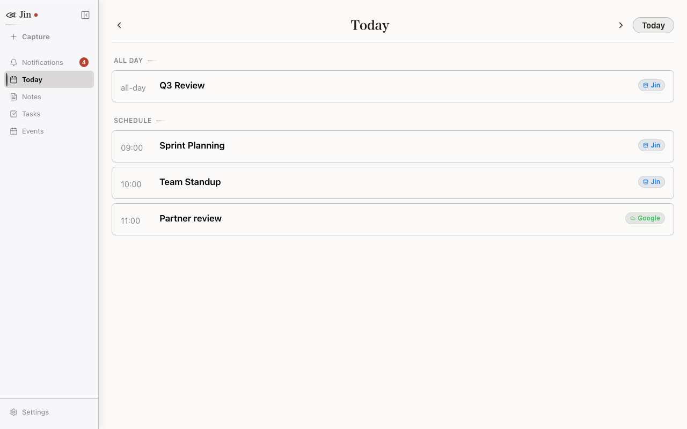

<div align="center">


# Jin

**One local workspace for notes, tasks, and calendar context.**

[](https://github.com/Rynaro/jin/actions/workflows/ci.yml)
[](LICENSE)
[](#architecture)

[Build from source](#build-from-source) · [Read the docs](#documentation) · [Contribute](CONTRIBUTING.md)

</div>

Jin is an open-source, local-first productivity app for the daily seams between
notes, tasks, and calendar events. Its canonical data is Markdown and YAML
files you control; SQLite is a rebuildable index. The Rust core powers both a
scriptable CLI and a desktop GUI, so the two surfaces share one model rather
than drifting apart.

> Jin exists first to solve my own needs. If it works for you too, that’s
> wonderful. I’m happy to review thoughtful augmentations, fixes, and
> suggestions, while keeping the project aligned with the problems it was
> created to solve.

## What it is for

- Capture a note, task, or event without splitting context across separate apps.
- Link preparation notes to appointments and promote a task into scheduled time.
- See a single local agenda, with optional Google Calendar synchronization.
- Use desktop reminders and native notifications while the Jin GUI is running.
- Keep the primary store inspectable and portable instead of trapped in a service.

## Development preview



This is a deterministic browser-fixture screenshot of the built frontend. It is
useful for showing the interface, but it is not proof of native Tauri behavior
or cross-platform visual sign-off.

## The workflow

```console
$ jin init
$ jin note add "Roadmap review notes"
$ jin task add "Draft quarterly roadmap"
$ jin promote <task-id> --when 2026-07-01T10:00:00 --tz UTC
$ jin attach <note-id> <event-id>
$ jin today --date 2026-07-01
```

`jin promote` turns a task into a calendar event; `jin attach` preserves the
relationship between an event and its prep notes. The `today` agenda brings the
linked context back together.

Reminder delivery is device-local and depends on the desktop GUI being
available; reminder state is not canonical data and is not synced between
devices.

## Build from source

Jin is currently distributed as a source project. You need Rust, Node.js 20+
and npm 10+ for the GUI. On Linux, install the system dependencies required by
[Tauri](https://v2.tauri.app/start/prerequisites/); on macOS, install Xcode
Command Line Tools.

```bash
git clone https://github.com/Rynaro/jin.git
cd jin

# Core checks and CLI build
make verify
cargo build --release -p jin

# Start a local store
./target/release/jin --root ~/jin-store init
./target/release/jin --root ~/jin-store note add "First note"
./target/release/jin --root ~/jin-store --json task list
```

To work on the desktop GUI:

```bash
cd jin-gui
npm ci
npx tauri dev
```

For the full GUI verification gate, run `make verify-gui`; `make verify-all`
runs the core and GUI gates in sequence.

### Google Calendar: bring your own OAuth client

Source builds use your own Google Desktop OAuth client. Set
`JIN_GOOGLE_CLIENT_ID` and `JIN_GOOGLE_CLIENT_SECRET`, or configure the
per-vault `[google]` section. Jin uses PKCE; nevertheless, never commit a real
credential. Follow the [Google smoke-test guide](docs/google-smoke-test.md)
before using a real account.

## Architecture

```text
CLI + Tauri GUI
       │
       ▼
  jin-core (Rust)
  model · links · sync · audit
       │
       ▼
Markdown + YAML (canonical) ──► SQLite (rebuildable index)
```

- **One model:** typed notes, tasks, events, and first-class links.
- **Local ownership:** files are canonical; the index can be rebuilt.
- **Shared core:** the GUI is a consumer of the same headless Rust core as the CLI.
- **Optional calendar sync:** Google synchronization includes conflict handling and audit data.

More context is in the [architecture ADRs](docs/adr/) and
[data-model decision](docs/adr/0001-data-model-and-linking.md).

## Status and limits

Jin is an active, pre-1.0 personal project. The core and CLI are at `0.14.0`;
the GUI package is `0.22.1` while its Tauri application configuration reports
`0.14.0`. These version lines are not yet a promise of release stability.

The project has automated core and GUI logic checks, including deterministic
core verification. Headless checks do not certify native rendering. Real-account
OAuth validation, recurring-event editing, multi-device synchronization, rich
notes, and mobile capture remain work in progress. Reminder delivery is also
dependent on the local desktop environment. See
[GUI testing](docs/gui-testing.md) and [testing](docs/testing.md) for the
current verification boundaries.

## Documentation

- [Getting oriented](discovery/00-discovery-and-gaps.md)
- [Architecture decisions](docs/adr/)
- [Testing strategy](docs/testing.md)
- [GUI testing and visual-QA boundaries](docs/gui-testing.md)
- [Google Calendar smoke test](docs/google-smoke-test.md)
- [Contributing](CONTRIBUTING.md)
- [Security reporting](SECURITY.md)

## Contributing

Issues, focused fixes, and well-scoped augmentations are welcome. Please read
[CONTRIBUTING.md](CONTRIBUTING.md) for setup, checks, and the review checklist.

## License

Jin is licensed under the [GNU Affero General Public License v3.0](LICENSE).
