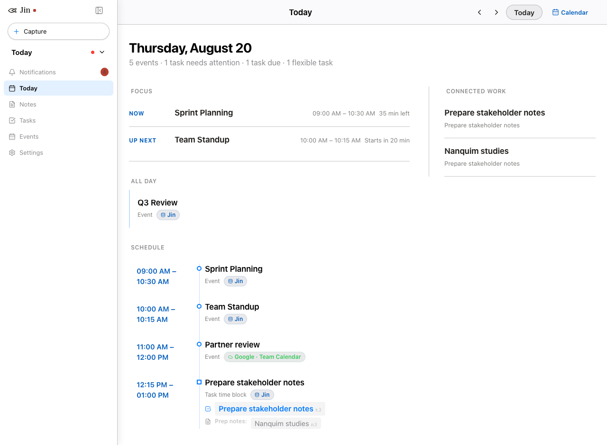

<div align="center">


# Jin

**Notes, tasks, and calendar context in one local workspace.**

[](https://github.com/Rynaro/jin/actions/workflows/ci.yml)
[](LICENSE)

[Downloads](https://github.com/Rynaro/jin/releases) · [Quick start](#quick-start) · [Build from source](#build-from-source) · [Contribute](CONTRIBUTING.md)

</div>

Jin stores your notes, tasks, and events as Markdown and YAML files you control.
SQLite is a rebuildable index. The desktop app and scriptable CLI share the same
Rust core and local data model. Google Calendar sync is optional.

## Download and install

The [Releases page](https://github.com/Rynaro/jin/releases) is the source of
published binaries. The v1.0.0 pipeline produces these files when its release
is published:

| System | Desktop app | CLI |
| --- | --- | --- |
| macOS, Apple Silicon (arm64) | DMG | jin-cli-1.0.0-macos-aarch64.tar.gz |
| Linux, x86-64 | DEB or AppImage | jin-cli-1.0.0-linux-x86_64.tar.gz |
| Windows, x86-64 | NSIS setup EXE | jin-cli-1.0.0-windows-x86_64.zip |

On macOS, open the DMG and drag Jin to Applications. On Linux, install the DEB
with your package manager, or mark the AppImage executable and run it. On
Windows, run the setup EXE. The CLI archives contain a single jin executable
(jin.exe on Windows); extract it and place it on your PATH.

The macOS app uses ad-hoc signing and is **not Apple notarized**. Windows
installers are **not code signed**. Your operating system may display an
unverified-developer warning. The Linux packages are built on Ubuntu 24.04 x64
and need a graphical desktop with WebKitGTK support. Other distributions may
need different system libraries. Published releases include SHA256SUMS; compare the
downloaded file's SHA-256 hash before running it.

## Quick start

The desktop app guides you through choosing a local storage folder on first
launch. The CLI can initialize a store explicitly:

```console
$ jin --root ~/jin-store init
$ jin --root ~/jin-store note add "Roadmap review notes"
$ jin --root ~/jin-store task add "Draft quarterly roadmap"
$ jin --root ~/jin-store today
```

Run `jin --help` for commands and `jin <command> --help` for options. Jin can
link preparation notes to events and promote a task into scheduled time.
Reminders are delivered locally while the desktop app is running; reminder
state does not sync between devices.

## A look at Jin



This Today screenshot uses demo data. It illustrates the interface; it does
not establish native rendering quality on every supported system.

## Build from source

Install stable Rust, Node.js 20+ and npm 10+ for the desktop app. macOS needs
Xcode Command Line Tools. Linux needs the [Tauri system prerequisites](https://v2.tauri.app/start/prerequisites/).

```bash
git clone https://github.com/Rynaro/jin.git
cd jin
python3 scripts/check-release-version.py
make verify
cargo build --release --locked -p jin
./target/release/jin --root ~/jin-store init
```

To run the desktop app during development:

```bash
cd jin-gui
npm ci
npm run tauri -- dev
```

`make verify-gui` runs the GUI logic gate; `make verify-all` runs both gates.
Native bundle checks, release assets, and publication steps are documented in
the [release runbook](docs/releasing.md).

## Data, sync, and current limits

The canonical store is local Markdown and YAML. The Rust core provides the CLI
and desktop app with one model for notes, tasks, events, and links. The SQLite
index can be rebuilt. Optional Google Calendar sync uses your own Desktop
OAuth client; see the [Google setup and smoke test](docs/google-smoke-test.md).

Version 1.0.0 identifies the first coordinated binary release. Real-account
OAuth validation, recurring-event editing, multi-device synchronization, rich
notes, and mobile capture remain work in progress. Automated GUI checks cover
logic, while native appearance and interaction require a human pass on each
platform. See [GUI testing](docs/gui-testing.md) and [testing](docs/testing.md).

## Contributing and license

Read [CONTRIBUTING.md](CONTRIBUTING.md) for setup and checks, and
[SECURITY.md](SECURITY.md) for security reporting. Architecture decisions live
in [docs/adr](docs/adr/), and the GUI's visual language is described in
[docs/visual-language](docs/visual-language/README.md).

Jin is licensed under the [GNU Affero General Public License v3.0](LICENSE).
